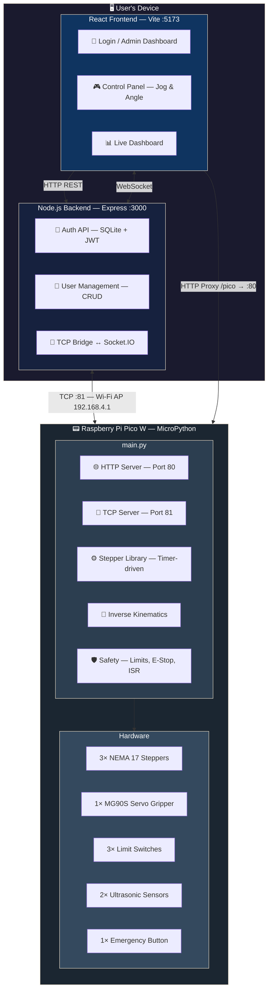

# 🤖 ARMOBOT — 3-Axis Robotic Arm Control System

A full-stack IoT project that controls a **3-axis robotic arm** via a **Raspberry Pi Pico W**. The arm is operated through a modern **React web dashboard** that communicates in real-time with the microcontroller over Wi-Fi — no internet connection required.

---

## 📐 System Architecture



---

## 📁 Project Structure

```
Armobot-control-system/
│
├── main.py                          # Pico W firmware (MicroPython)
│
├── lib/
│   └── stepper/
│       └── __init__.py              # micropython-stepper library (Timer-based)
│
├── backend/
│   ├── server.js                    # Express + Socket.IO + SQLite backend
│   ├── package.json
│   └── database.sqlite              # Auto-generated user database
│
├── frontend/
│   ├── src/
│   │   ├── App.jsx                  # Root component with routing & auth
│   │   ├── main.jsx                 # React entry point
│   │   ├── index.css                # Global styles
│   │   ├── App.css                  # App-level styles
│   │   └── components/
│   │       ├── Login.jsx            # User login form
│   │       ├── Register.jsx         # User registration form
│   │       ├── ConnectionSetup.jsx  # Wi-Fi connection prompt
│   │       ├── Dashboard.jsx        # Live joint angle & gripper display
│   │       ├── ControlPanel.jsx     # Stepper motor jog & angle control
│   │       ├── ActionPanel.jsx      # Gripper, calibration, pick & place
│   │       └── AdminDashboard.jsx   # User management (CRUD)
│   ├── public/
│   │   ├── favicon.svg
│   │   └── icons.svg
│   ├── vite.config.js               # Vite config with /pico proxy
│   └── package.json
│
├── Raspberry Pi Pico - Circuit Connection Diagram.fzz   # Fritzing schematic
├── Raspberry Pi Pico - Circuit Connection Diagram.svg   # Viewable circuit diagram
└── Raspberry Pi Pico pinout diagram.svg                 # Pico W pin reference
```

---

## ⚙️ Hardware Requirements

| Component | Quantity | Purpose |
|---|---|---|
| Raspberry Pi Pico W | 1 | Main microcontroller (Wi-Fi) |
| NEMA 17 Stepper Motors | 3 | Joint 1 (Base), Joint 2 (Shoulder), Joint 3 (Elbow) |
| A4988 / DRV8825 Stepper Drivers | 3 | Motor driving |
| MG90S Servo Motor | 1 | Gripper open/close |
| Limit Switches | 3 | Mechanical homing and safety |
| HC-SR04 Ultrasonic Sensors | 2 | Distance measurement (left & right) |
| Push Button (NO) | 1 | Emergency stop |
| 12V Power Supply | 1 | Stepper motor power |
| 5V Power Supply | 1 | Pico W and servo power |

---

## 🔌 Pin Mapping (Raspberry Pi Pico W)

| Function | GPIO Pin |
|---|---|
| **Joint 1** — Step | GP11 |
| **Joint 1** — Dir | GP9 |
| **Joint 2** — Step | GP13 |
| **Joint 2** — Dir | GP7 |
| **Joint 3** — Step | GP15 |
| **Joint 3** — Dir | GP14 |
| **Gripper Servo** (PWM) | GP26 |
| **Limit Switch 1** | GP3 |
| **Limit Switch 2** | GP2 |
| **Limit Switch 3** | GP4 |
| **Ultrasonic Right** — Trig | GP18 |
| **Ultrasonic Right** — Echo | GP19 |
| **Ultrasonic Left** — Trig | GP20 |
| **Ultrasonic Left** — Echo | GP21 |
| **Emergency Stop Button** | GP16 |

### Circuit Connection Diagram


---

## 🚀 Getting Started

### Prerequisites

- [Node.js](https://nodejs.org/) (v18+ recommended)
- [Thonny IDE](https://thonny.org/) (for flashing MicroPython to Pico W)
- MicroPython firmware installed on Raspberry Pi Pico W

### 1. Flash the Pico W Firmware

1. Install MicroPython on your Pico W ([official guide](https://www.raspberrypi.com/documentation/microcontrollers/micropython.html)).
2. Open **Thonny** and connect to the Pico W.
3. Install the stepper library on the Pico via the REPL:

   ```python
   import mip
   mip.install("github:redoxcode/micropython-stepper")
   ```

4. Upload the following to the Pico W's filesystem:
   - `main.py` → root (`/`)
   - `lib/stepper/__init__.py` → `/lib/stepper/__init__.py`
5. Restart the Pico W. It will:
   - Create a Wi-Fi Access Point: **`RoboticArm_AP`** (password: `12345678`)
   - Start an HTTP server on port **80**
   - Start a TCP bridge on port **81**

### 2. Start the Backend

```bash
cd Armobot-control-system/backend
npm install
npm start
```

The backend runs on `http://localhost:3000` and:

- Provides JWT-based authentication API
- Manages users via SQLite database
- Creates a default admin account: **`admin`** / **`admin123`**
- Maintains a persistent TCP connection to the Pico W (`192.168.4.1:81`)
- Bridges real-time jog data between the Pico and the frontend via Socket.IO

### 3. Start the Frontend

```bash
cd Armobot-control-system/frontend
npm install
npm run dev
```

The frontend runs on `http://localhost:5173` and:

- Proxies `/pico/*` requests to the Pico W's HTTP server (`192.168.4.1:80`) via Vite's proxy
- Connects to the backend's Socket.IO for real-time position updates

### 4. Connect & Control

1. Connect your PC to the **`RoboticArm_AP`** Wi-Fi network (password: `12345678`).
2. Open `http://localhost:5173` in your browser.
3. Log in with the default credentials (`admin` / `admin123`).
4. Confirm the Wi-Fi connection on the setup screen.
5. Start controlling the arm!

---

## 🎮 Features

### Control Panel

- **Angle Input**: Type a specific degree value and hit "Apply" to move any joint to an exact position.
- **Jog Buttons**: Press and hold to smoothly move a joint in real-time. Release to stop. Uses WebSocket → TCP for low-latency control.
- **Dynamic Range Limits**: Joint 2 and Joint 3 limits update dynamically based on each other's position using inverse kinematics, preventing self-collision.

### Actions

- **Gripper**: Open/Close the servo-driven gripper.
- **Calibrate**: Homes all three joints simultaneously by driving them to their limit switches, then returning to 0°.
- **Pick & Place**: Save two positions, then execute an automated pick-and-place cycle between them.
- **Continuous Mode**: Loop the pick-and-place sequence automatically.

### Admin Dashboard

- **User Management**: Create, update, and delete user accounts.
- **Role-based Access**: Only admins can access the admin panel.
- **User Metadata**: Store company, address, city, and country per user.

### Safety System

- **Emergency Stop**: Physical button instantly halts all motors. System blocks until released.
- **Limit Switches**: Hardware interrupts (ISR) immediately flag when a joint hits its mechanical limit. All movement is blocked until the next command clears the flag.
- **Kinematic Coupling**: `solve_d2()` and `solve_d3()` continuously recalculate safe ranges based on the arm's current configuration.

---

## 🌐 API Reference

### Pico W HTTP Endpoints (Port 80)

| Endpoint | Method | Description |
|---|---|---|
| `/stepper?motor=X&angle=Y` | GET | Move joint X to Y degrees |
| `/gripper?action=open\|close` | GET | Open or close gripper |
| `/calibrate` | GET | Home all joints |
| `/save_movement1` | GET | Save current position as Position 1 |
| `/save_movement2` | GET | Save current position as Position 2 |
| `/run1` | GET | Go to saved Position 1 |
| `/run2` | GET | Go to saved Position 2 |
| `/pickplace` | GET | Execute pick & place between saved positions |
| `/start_continuous` | GET | Start continuous pick & place loop |
| `/stop_continuous` | GET | Stop continuous loop |
| `/status` | GET | JSON: joint angles, distances, emergency state |
| `/get_range2` | GET | JSON: current min/max for Joint 2 |
| `/get_range3` | GET | JSON: current min/max for Joint 3 |

### Pico W TCP Bridge (Port 81)

| Command | Direction | Description |
|---|---|---|
| `START_{axis}_{dir}\n` | Client → Pico | Begin jogging axis (1-3), dir (0=neg, 1=pos) |
| `STOP\n` | Client → Pico | Stop jogging |
| `{"s1":..,"s2":..,"s3":..,"n2":..,"x2":..,"n3":..,"x3":..}` | Pico → Client | Real-time state (every 100ms) |

### Backend REST API (Port 3000)

| Endpoint | Method | Auth | Description |
|---|---|---|---|
| `/api/auth/login` | POST | No | Login → returns JWT token |
| `/api/users` | GET | Admin | List all users |
| `/api/users` | POST | Admin | Create user |
| `/api/users/:id` | PUT | Admin | Update user |
| `/api/users/:id` | DELETE | Admin | Delete user |

---

## 🔧 Tech Stack

### Firmware


[](https://github.com/redoxcode/micropython-stepper)

### Backend


### Frontend


### Hardware


